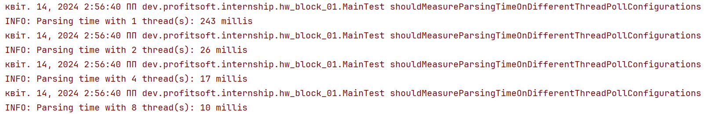

# Run program

In order to run the program we need to compile the hw_block_01.jar, which is typically located under target directory.
To do this you are supposed to take a few steps:
<ol>
    <li>Under project hw_block_01 run <b>mvn clean package</b></li>
    <li>Run <b>java -jar .\hw_block_01.jar "path" "attribute"</b></li>
    <li>Navigate to the <b>"path"</b> and see your results in file named <b>statistics_by_"attribute"</b></li>
</ol>

# JSON input structure

The input JSON structure presents as an array of following items:

```
{
    "firstName": "Violet",
    "lastName": "Godehard.sf",
    "birthDay": "1995-07-12",
    "courses": "Theology and Religion, Computer Science, Chemistry, Earth Sciences, English"
  }
```

# JSON output structure

The output structure presents as an array of items under statistics tag. Each item is a name of attribute value and
number of its occurrence in JSON files

```
<statistics>
    <item>
        <value>History</value>
        <count>4643</count>
    </item>
    <item>
        <value>Computer Science</value>
        <count>4636</count>
    </item>
    <item>
        <value>Archaeology</value>
        <count>4628</count>
    </item>
    <item>
        <value>Mathematics</value>
        <count>4620</count>
    </item>
    <item>
        <value>Law</value>
        <count>4618</count>
    </item>
    <item>
        <value>Earth Sciences</value>
        <count>4605</count>
    </item>
    <item>
        <value>Chemistry</value>
        <count>4603</count>
    </item>
    <item>
        <value>Theology and Religion</value>
        <count>4602</count>
    </item>
    <item>
        <value>Physics</value>
        <count>4588</count>
    </item>
    <item>
        <value>English</value>
        <count>4584</count>
    </item>
    <item>
        <value>Engineering Science</value>
        <count>4577</count>
    </item>
    <item>
        <value>Philosophy</value>
        <count>4565</count>
    </item>
</statistics>
```

# Multithreading Tests
As we can see below the multithreading makes sense and the biggest performance and velocity was achieved in case of using 8 threads
